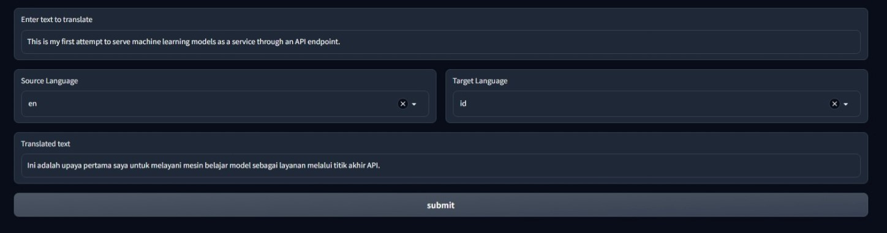

# machine-translation-api
Deploying machine learning models using as a RESTful API via BentoML


*Currently supported translation: en-id & id-en*
*Models from huggingface hub: https://huggingface.co/Helsinki-NLP*

## Installation
1. Clone the repository 
2. Create a virtual environment and activate it
```bash
python -m venv venv
source venv/Scritps/activate
```
3. Install required dependencies from requirements.txt
```bash 
pip install -r requirements-dev.txt
```

## API
1. Fetch models from huggingface hub and save them as BentoML models. *This step is only required once.*
```bash
cd src
python save_model.py
```
2. Start the BentoML developement server
```bash
bentoml serve service:svc --api-workers 2
```
*use --api-workers 2 to run to avoid extensively hammering the CPU. It can be changed to any number depending on your machine's CPU cores.*

3. Open http://127.0.0.1:3000 in your browser and send test request from the web UI.
Make sure to specify three important components in the request body. For example:
```json
{
    "text": "Hello world",
    "source_language": "en",
    "target_language": "id"
}
```

## Web UI
**Requirements** 
- Docker

### Steps
1. Follow the first step in the API section above.
2. Build the bento to prepare the deployment.
```bash
bentoml build
```
3. Containerize the API as a docker image
```bash
bentoml containerize multi-translator:latest
```
4. Run the docker image
```bash
docker run -p 3000:3000 multi-translator:hokdnioehogid2ci serve --production --api-workers 2
```
*hokdnioehogid2ci* is a unique ID to your bento object. You may want to change that to suit your bento unique ID which can be found after the containerization process.
      
5. Run the web UI
```bash
cd gradio
python app.py
```

Advantages of BentoML:
- Easy to deploy
- Easy to integrate with other cloud providers (AWS, GCP, Azure)
- Easy to integrate with other machine learning frameworks (PyTorch, Tensorflow, Keras, etc)
- Handle heavy-lifting of model deployment which can be contolled through command line (adaptive-batching, kubernetes, docker, etc) 